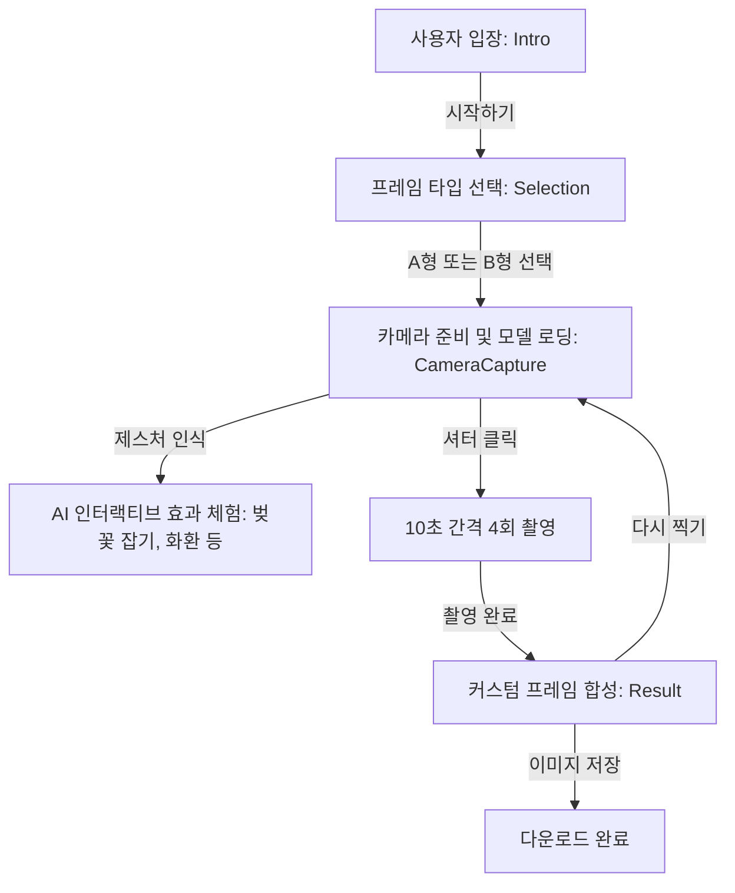

# 🌸 벚꽃 네컷 웹 애플리케이션 구조도 및 흐름도

본 문서는 '벚꽃 네컷(Cherry Blossom Taker)' 프로젝트의 화면 구조와 사용자 흐름을 상세히 설명하기 위해 작성되었습니다.

## 🏗️ 전체 아키텍처 및 기술 스택
- **프레임워크**: React (Vite)
- **AI 엔진**: Google MediaPipe (Face 및 Hand 랜드마크 실시간 추적)
- **물리 엔진**: Matter.js (벚꽃잎 낙하 및 충돌 시뮬레이션)
- **스타일링**: Vanilla CSS (유리모피즘 및 다이나믹 애니메이션 적용)

---

## 📱 화면 구조 및 상세 설명

### 1. 인트로 화면 (`Intro.tsx`)
- **역할**: 애플리케이션의 테마(벚꽃)를 시각적으로 보여주며 시작을 유도합니다.
- **기능**: '시작하기' 버튼 클릭 시 프레임 선택 화면으로 이동합니다.

### 2. 프레임 선택 화면 (`FrameSelection.tsx`)
- **역할**: 사진 인화물의 레이아웃 유형을 선택합니다.
- **옵션**:
  - **A형 (데스크톱 용)**: 2x6인치 세로형 (1열 4행), 4컷 촬영.
  - **B형 (모바일 용)**: 4x6인치 직사각형 (2열 2행), 4컷 촬영.

### 3. 촬영 화면 (`CameraCapture.tsx`)
- **역할**: 실시간 AI 효과가 적용된 상태에서 사진을 연속 촬영합니다.
- **핵심 로직**:
  - `useMediaPipe`: 카메라 피드에서 사람의 손과 얼굴을 실시간 감지.
  - `useMatterPhysics`: 감지된 랜드마크와 연동하여 벚꽃잎 탄성 및 충돌 처리.
- **실시간 인터랙티브 효과**:
  - **V 제스처 (✌️)**: 머리 위에 예쁜 화환 생성.
  - **머리 위 손하트 (🫶)**: 머리 위에서 하트가 뿅 나타남.
  - **손 꽃받침 (🤗)**: 머리 주변에 나비가 찾아와 날개짓 함.
  - **벚꽃 잡기 (🫴)**: 손바닥이나 손등 위에 벚꽃잎을 쌓고 밀어낼 수 있음.
- **촬영 프로세스**:
  - 셔터 클릭 시 10초 카운트다운 후 총 4장 연속 촬영.
  - 각 촬영은 현재 캔버스의 모든 물리 효과와 렌더링을 그대로 `DataURL`로 캡처.

### 4. 결과 및 저장 화면 (`Result.tsx`)
- **역할**: 촬영된 4장의 사진을 선택한 프레임 디자인에 합성하여 보여줍니다.
- **기능**: 
  - 랜덤 격려 문구 삽입 (예: "오늘 너라는 꽃이 활짝 피었네!").
  - 300DPI 인쇄 가능 수준의 고해상도 합성 이미지 생성.
  - '저장하기' 기능을 통한 이미지 다운로드 지원.

---

## 🔄 사용자 비즈니스 로직 흐름도

---

## 📝 관리 및 업데이트 기록
*본 섹션은 향후 업데이트되는 모든 사항이 자동으로 기록되는 공간입니다.*

- **2026-04-01**: 프로젝트 초기 구조화 및 벚꽃 인터랙션 로직(Matter.js) 구현.
- **2026-04-01**: A형(데스크톱) 촬영 화면 1.4배 확대 및 이모지 화환 기능 업데이트.
- **2026-04-01**: 벚꽃 겹쳐 쌓기(Stacking) 카운팅 알고리즘 도입.
- **2026-04-01**: 떨어지는 벚꽃 크기 1.2배 상향 및 렌더링 한도(LIMIT) 40개로 조정.
- **2026-04-01**: 'STRUCTURE.md' 생성 및 상세 흐름도(Mermaid) 추가.
- **2026-04-01**: 기술 부채 해결(브레인 누수 방지용 Ref 업데이트 방식 개선) 및 개발자 수치 가이드 추가.
- **2026-04-01**: 인트로 디자인 개편('벚꽃 네컷' 타이틀), 사용방법 모달 및 전역 푸터 추가.

---

## 🎨 개발자 조절용 주요 수치 가이드 (바이브코딩용)

애플리케이션의 디자인 및 성능을 세부적으로 조정하고 싶은 개발자들을 위한 물리 수치 및 UI 스타일 가이드입니다.

### [NEW] 전역 요소
- **공통 푸터 (`App.tsx`)**:
  - 모든 화면 하단에 상주하며 저작권 정보와 문의처를 표시합니다.
  - 모바일 반응형 대응 (세로 정렬 지원).

### 1. 카메라 캡처 및 스테이지 관련 (`CameraCapture.tsx`, `CameraCapture.css`)
- **스테이지 크기 (네이티브 해상도)**:
  - **A형 (데스크톱)**: 너비 `896px`, 높이 `640px` (기존 1.4배 확대됨)
  - **B형 (모바일)**: 너비 `480px`, 높이 `686px`
- **[NEW] 촬영 준비 가이드**: 촬영 시작 시 **5초간** 거리 유지 및 인식 팁 안내 모달이 자동으로 나타나고 사라집니다.
- **화면 표시 제약**:
  - `stage-wrapper` 최대 높이: `85vh` (화면 비율에 따라 유연하게 조절됨)
- **카운트다운 및 타이머**:
  - 셔터 카운트다운: `10초`
  - 촬영 후 다음 촬영 대기(인터벌): `1000ms`
- **패딩 및 여백**:
  - 하단 제스처 가이드 영역: `padding: 0.35rem 1.2rem`

### 2. 벚꽃 물리 엔진 설정 (`useMatterPhysics.ts`)
- **꽃잎 크기**:
  - **A형**: 기존 사이즈 (Blossom `58px`, Petal `50px`)
  - **B형 (모바일)**: **0.8배 축소** (Blossom `46px`, Petal `40px`)
- **화면 내 생존 한도 (`LIMIT`)**:
  - **A형**: 최대 `40개`
  - **B형 (모바일)**: 성능 최적화를 위해 최대 **30개**로 제한
- **낙하 속도 및 중력**:
  - 중력 값(Gravity): `y: 0.6`
  - 스폰 간격(Interval): `700ms` (숫자가 작을수록 더 빠르게 많이 떨어짐)
- **손바닥 상호작용 (Hidden Collider)**:
  - 가상 손 크기: 너비 `150px`, 높이 `24px`
  - 마찰력 (Friction): `1.0` (꽃잎이 잘 고정되도록 높게 설정)
- **꽃잎 쌓기 인식 범위 (Stacking Algorithm)**:
  - 가로 인식 반경: `100px`
  - 세로 인식 반경: `55px`
  - 안착 판정 속도: `1.8` 이하로 움직일 때만 '쌓인 상태'로 간주

### 3. 결과 인화지 레이아웃 및 폰트 (`Result.tsx`, `Result.css`)
- **인화지 해상도 (300DPI 인쇄 기준)**:
  - **A형**: `600 x 1800 px`
  - **B형**: `1200 x 1800 px`
- **레이아웃 여백 (`Result.tsx` 상단 상수)**:
  - 사진 간격/외부 여백 (`PAD`): `14px`
  - 하단 텍스트 띠지 높이 (`TEXT`): `90px`
- **폰트 크기**:
  - 결과지 본문 메시지: A형 `28px`, B형 `36px`

### 4. 주요 UI 컴포넌트 스타일 (`Intro.css`, `FrameSelection.css`)
- **메인 타이틀 폰트 크기**: `3.5rem` (인트로), `2.5rem` (프레임 선택)
- **카드 UI (`FrameSelection.tsx`)**:
  - 카드 너비: `280px`
  - 내부 패딩: `2.5rem 1.5rem`
- **버튼 공통 스타일**:
  - 기본 패딩: `1.2rem 3rem`
  - 셔터(Shoot) 버튼: `1rem 3rem`, 폰트 `1.6rem`
